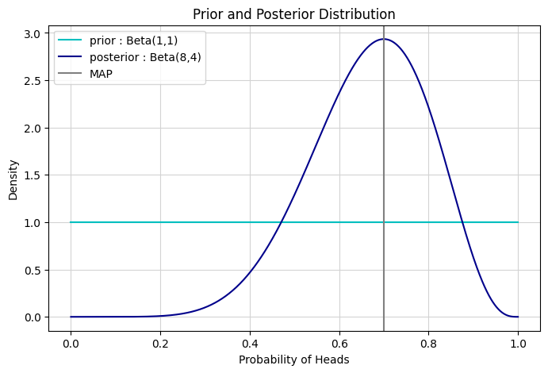
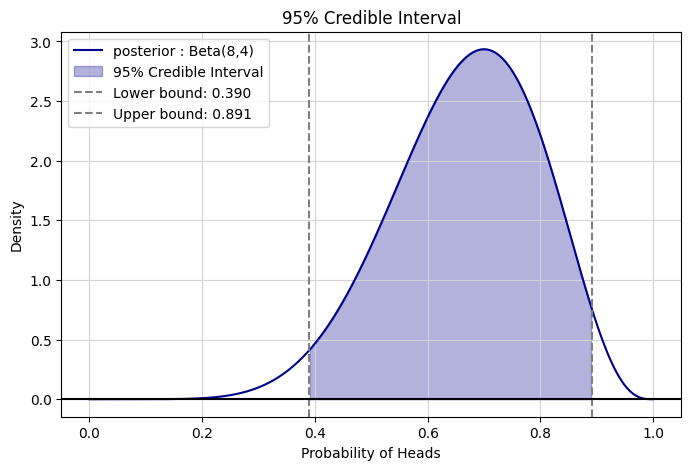
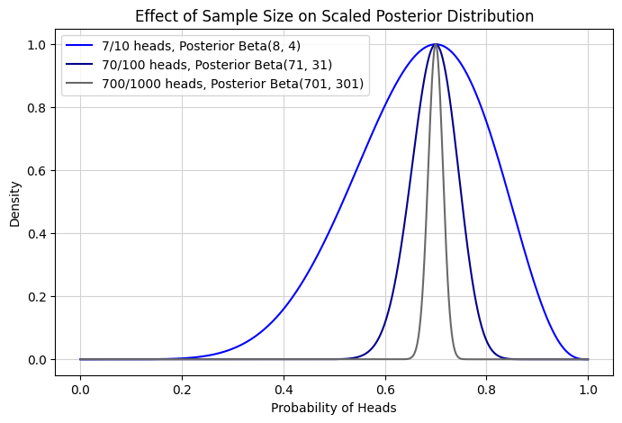
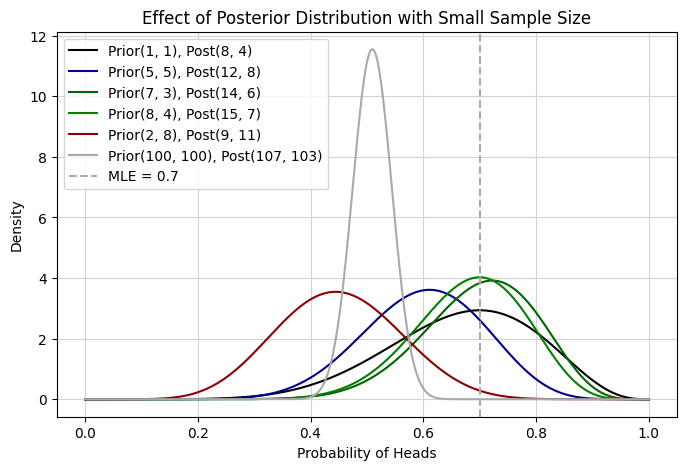
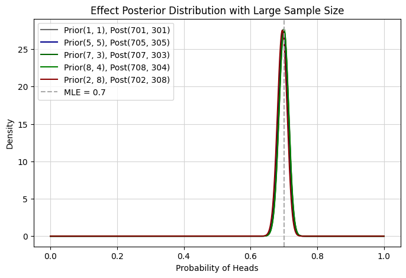

# Bayesian Estimation for Coin Toss

コイン投げを題材に、最尤推定（MLE）・最大事後確率推定（MAP）・ベイズ推定の違いを可視化しながら整理した学習ノート。

## 参照時の注記

GitHub上で `notebook.ipynb` を直接開くと、環境によってNotebookプレビューがエラーになる場合がある。  
その場合は、同梱しているHTML版を参照のこと。

- 表示用HTML: [`docs/index.html`](./docs/index.html)
- 元Notebook: [`notebook.ipynb`](./notebook.ipynb)

GitHub Pagesを使う場合は、`Settings` → `Pages` → `Branch: main` → `Folder: /docs` を選ぶと、`docs/index.html` をWebページとして公開できます。

## 1. 課題/目的/ゴール

### 課題

例えば、コイン投げにおいて以下の3つのケースを考える。

- 10回中7回表が出た
- 100回中70回表が出た
- 1000回中700回表が出た

いずれも表が出た割合は0.7であり、最尤推定値も0.7となる。しかし、10回中7回と1000回中700回では、推定値に対する確信度は同じではない。

このように、観測された成功率だけを見ても、その推定値をどの程度信頼してよいか判断しづらい。  
また、標本数が少ない場合、観測値に対して過去データやドメイン知識をどのように推定に反映するかも重要となる。

### 目的

コイン投げを題材に、最尤法（MLE）・最大事後確率法（MAP）・ベイズ推定を比較する。

特に、以下の点を確認。

- MLE・MAP・ベイズ推定の違いを整理する
- 同じ成功率でも、標本数によって不確実性がどう変わるかを確認する
- 事前分布の方向や強さによって、事後分布がどう変わるかを確認する
- 標本数が大きくなると、事前分布の影響がどのように小さくなるかを確認する

| 手法 | 何を求めるか | 説明 |
|---|---|---|
| 最尤法（MLE） | 尤度が最大になるパラメータ | 観測データが最も起こりやすくなるパラメータを求める方法 |
| 最大事後確率法（MAP） | 事後分布が最大になるパラメータ | 観測データと事前分布を踏まえて、事後分布が最も高くなるパラメータを求める方法 |
| ベイズ推定 | 事後分布そのもの | 観測データと事前分布を踏まえて、パラメータの事後分布そのものを求める方法 |

### ゴール

A/BテストのCVR比較、広告施策のクリック率推定、少数レビューの商品評価など、少数データから意思決定を行う場面で必要な知識を身に付ける。

## 2. 結論

- MLEは観測データから1つの推定値を求めるため、同じ成功率であれば標本数が異なっても同じ推定値になる。
- MAPは事後分布が最大となるパラメータを求めるため、事前分布や標本数の影響を反映する。
- ベイズ推定は点推定ではなく事後分布を扱うため、信用区間の導出や推定の不確実性の可視化ができる。
- 標本数が少ないとき、事前分布の影響を強くうける。このとき、事前分布は過去データやドメイン知識を推定に反映するための仕組みとして解釈できる。
- 標本数が増えるほど、事前分布の影響は相対的に小さくなり、観測データの影響が支配的になる。

## 3. 内容

- 二項分布における尤度関数
- 最尤推定（MLE）の考え方
- ベイズ推定における事前分布・事後分布
- 最大事後確率推定（MAP）
- 標本数による不確実性の変化
- 事前分布の方向・強さが事後分布に与える影響

## 4. 可視化例

### ベイズ推定による事後分布と信用区間





Beta分布を事前分布として用いることで、二項分布に従う観測データによって事前分布を更新し、事後分布を得る。
このとき、Beta分布は二項分布の共役事前分布であるため、事後分布もBeta分布として表すことができる。
事後分布からは、点推定だけでなく、信用区間も導出できる。

### 標本数が大きくなると、不確実性は小さくなる



7/10、70/100、700/1000 はいずれも成功率は 0.7 だが、標本数が大きいほど事後分布は狭くなる。  
これは、データ量が増えるほど推定の不確実性が小さくなることを表している。

### 事前分布の影響




標本数が少ない場合、事前分布の設定によって事後分布の位置や幅が変化する。  
一方で、標本数が大きい場合は、事前分布の違いよりも観測データの影響が大きくなる。

## 5. 使用技術

- Python
- NumPy
- Matplotlib
- SciPy
- Jupyter Notebook / Kaggle Notebook

## 6. ファイル構成

```text
.
├── README.md
├── notebook.ipynb
├── notebook.html
├── docs/
│   └── index.html
├── images/
│   ├── figure_01.png
│   ├── figure_02.png
│   ├── figure_03.png
│   ├── figure_04.png
│   ├── figure_05.png
│   ├── figure_06.png
│   ├── figure_07.png
│   └── figure_08.png
└── requirements.txt
```

## 7. 実行方法

```bash
pip install -r requirements.txt
jupyter notebook notebook.ipynb
```

## 8. 補足

`notebook.ipynb` は元のNotebook作品として保存。  
`docs/index.html` と `notebook.html` は、Notebookの内容をブラウザで参照するための表示用ファイル。
